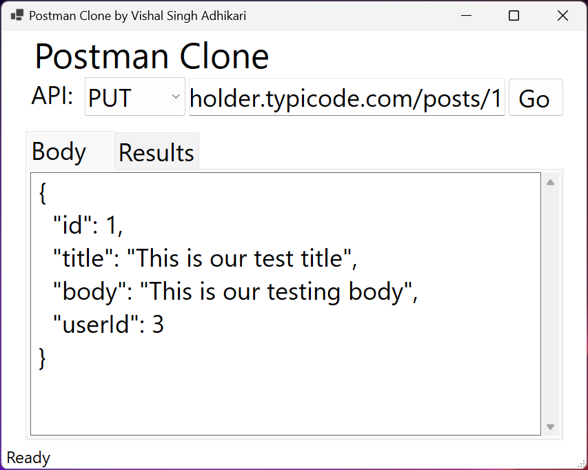
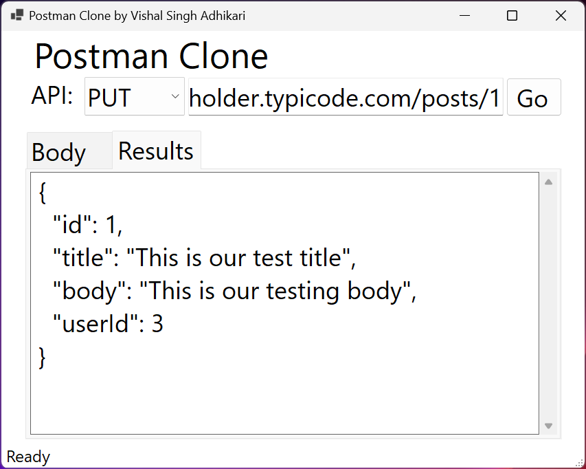
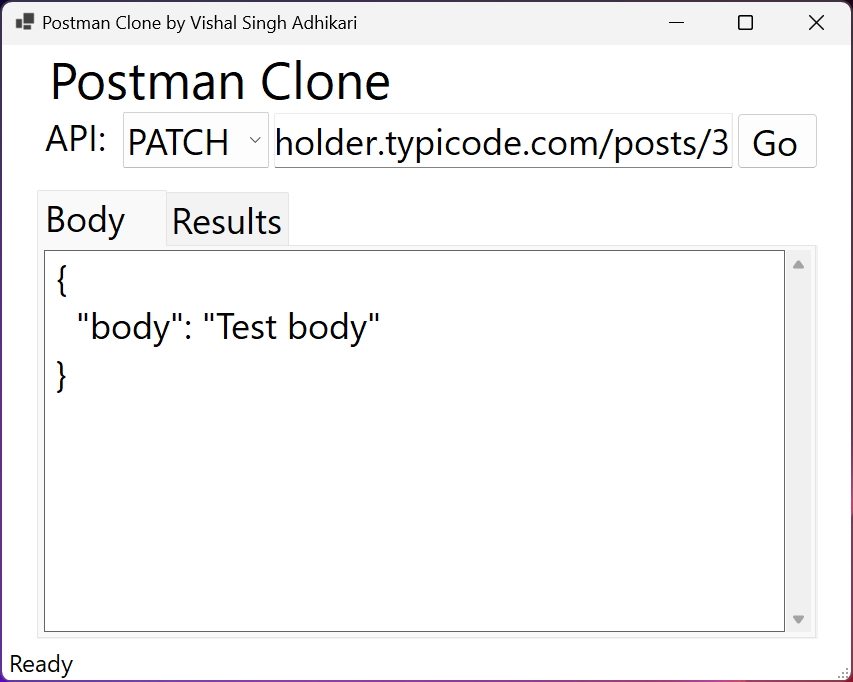
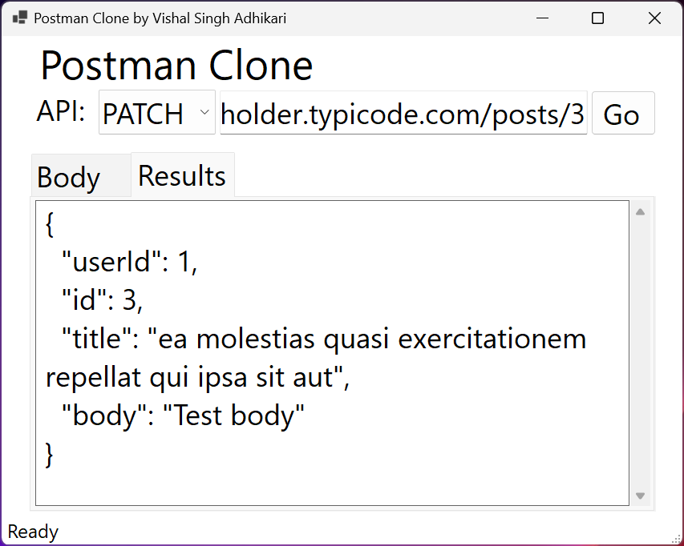
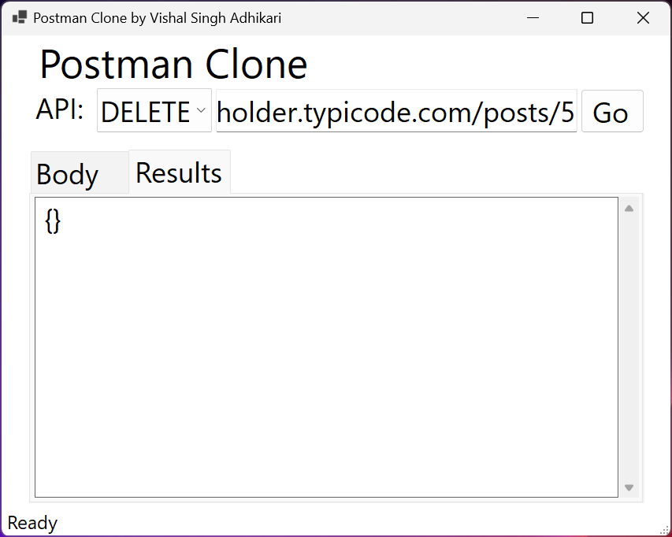

# Postman Clone
Postman Clone provides a user-friendly interface for making HTTP requests to APIs and viewing the responses in formatted JSON. Ideal for developers and testers, this tool simplifies API interaction and debugging, helping you efficiently validate and troubleshoot your API calls.

## Technologies Used
* C#
* .NET 8
* WinForms
* HttpClient

## Using The App
1. Download the executable file from the release section.
2. When the application launches, it should look like this:

3. Fill in your API URL, select 'GET' from the dropdown menu, and hit 'Go':

4. Fill in your API URL, select 'POST' from the dropdown menu, enter your JSON text in the 'Body' tab, and hit 'Go':

#### Body

#### Results

5. Fill in your API URL, select 'PUT' from the dropdown menu, enter your JSON text in the 'Body' tab, and hit 'Go':

#### Body

#### Results

6. Fill in your API URL, select 'PATCH' from the dropdown menu, enter your JSON text in the 'Body' tab, and hit 'Go':

#### Body

#### Results

7. Fill in your API URL, select 'DELETE' from the dropdown menu, and hit 'Go':

## Upcoming Changes
* Adding API headers
* Handling API authentication
* Adding Dependency Injection
* Adding Logging
* Create a web-based user interface for the application
